# MockForge

**Design, mock and test REST APIs entirely in the browser.**

**[Live demo](https://mockforge-lalit.vercel.app)** · [Source](https://github.com/lalitkumarrajak/mockforge)

MockForge is a client-side API mocking workbench. You define endpoints with templated, rule-driven responses; a [Mock Service Worker](https://mswjs.io) running in the page intercepts matching `fetch()` calls and answers them from your mocks. You get real HTTP semantics (status codes, headers, latency) with no backend and no sign-up. When the mocks look right, export them as typed MSW handlers and use them in your app, Storybook or Vitest.

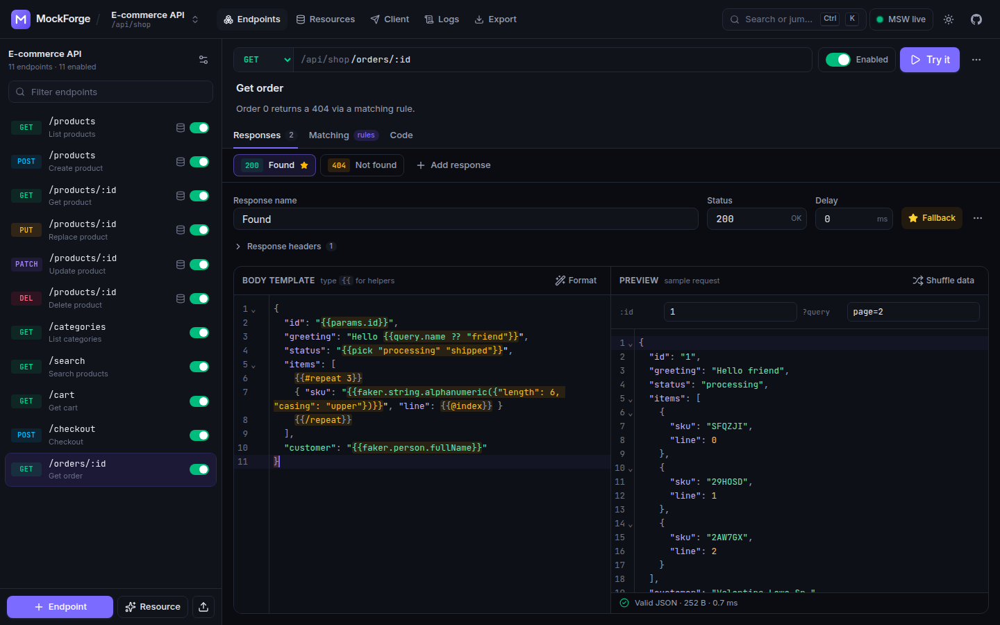

## Features

- **Collections**: each collection is a mock API with its own base URL. It can be relative (`/api/shop`, served from the app's own origin) or absolute (`https://api.example.com`).
- **Endpoints**: method, Express-style paths (`/users/:id`, `/files/*`), query matchers, an enabled toggle, and multiple response variants (status, headers, delay, body).
- **Variant selection**: either serve the starred _active_ response, or pick one with **rules** on path params, query, headers or JSON body fields (`equals`, `contains`, `exists`, `regex`, …). The active response is the fallback.
- **Dynamic templates** in a CodeMirror JSON editor, with autocompletion, inline lint errors and a live preview rendered against an editable sample request:
  ```handlebars
  { "id": "{{params.id}}", "page":
  {{query.page ?? 1}}, "email": "{{body.email}}", "name": "{{faker.person.fullName}}", "requestId":
  "{{uuid}}", "at": "{{now}}", "tags": [{{#repeat 2 5}}"{{faker.word.noun}}"{{/repeat}}] }
  ```
  Helpers: `faker.*` (with JSON args, e.g. `faker.number.int({"max": 9})`), `params`, `query`, `body`, `headers`, `uuid`, `now`, `timestamp`, `int`, `float`, `bool`, `pick`, `@index`, `{{#repeat n}}` / `{{#repeat min max}}`, and `??` fallbacks. Strings are JSON-escaped automatically.
- **Stateful CRUD resources**: one click on "Generate REST resource" (e.g. `users`) creates list/get/create/replace/update/delete endpoints. They're backed by a store seeded with faker data and persisted in IndexedDB, so POST-then-GET reflects your changes, even after a reload. The list endpoint supports `?page`, `?limit`, `?q`, `?sort&order` and field filters.
- **Built-in API client**: method, URL, params, headers, JSON body, `Ctrl/⌘+Enter` to send, per-collection history, copy as cURL. Every response shows which endpoint and variant served it.
- **Live request log**: every intercepted request with its matched endpoint and variant, outcome (matched / no route / 405 / template error) and latency, plus full request and response details.
- **OpenAPI 3 import** (JSON or YAML, pasted or as a file). It resolves `$ref`, `allOf`/`oneOf`, enums, formats and min/max constraints. Explicit examples are used verbatim. Otherwise schemas become realistic templates: property names pick fitting faker generators and path params are bound into ids.
- **Export**: a versioned collection JSON, a ready-to-paste **MSW v2 `handlers.ts`** (templates are compiled to real expressions like `faker.person.fullName()` and `params.id`, CRUD resources become an in-memory `db`), and a cURL command per endpoint.
- **Share via URL**: the collection is compressed into the URL hash with lz-string, so nothing is uploaded.
- **Starter templates**: E-commerce, Blog and Auth APIs.
- **UX**: command palette (`Ctrl/⌘+K`), keyboard shortcuts (`?`), dark/light/system theme, responsive layout, accessible dialogs, tabs and menus, empty and error states, and toasts.

## Screenshots

|                                                                                                   |                                                                                            |
| ------------------------------------------------------------------------------------------------- | ------------------------------------------------------------------------------------------ |
| 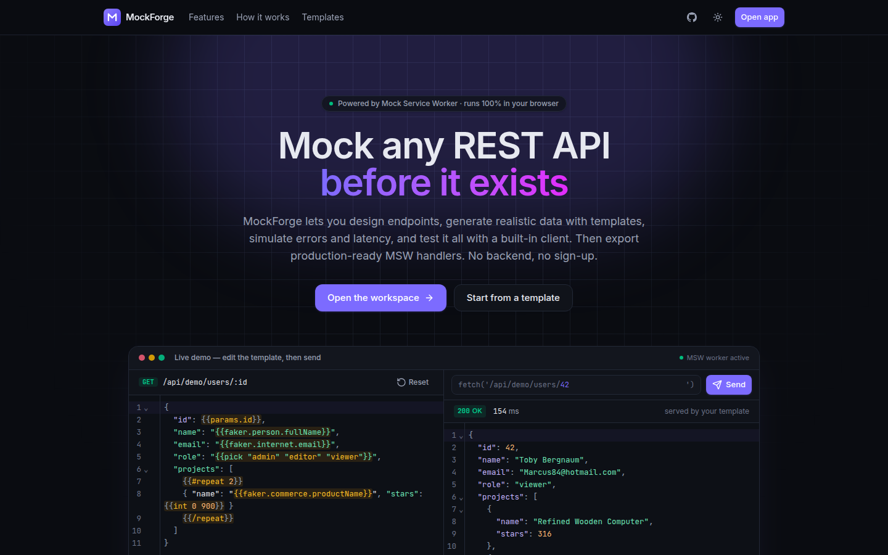 Landing page with a live demo served by MSW         | 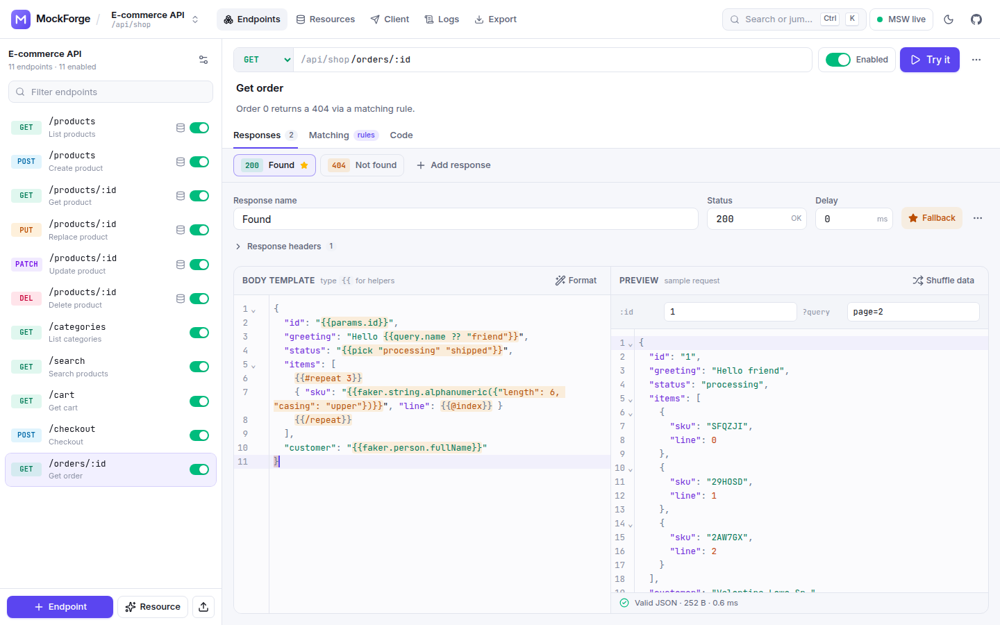 Light theme                     |
| 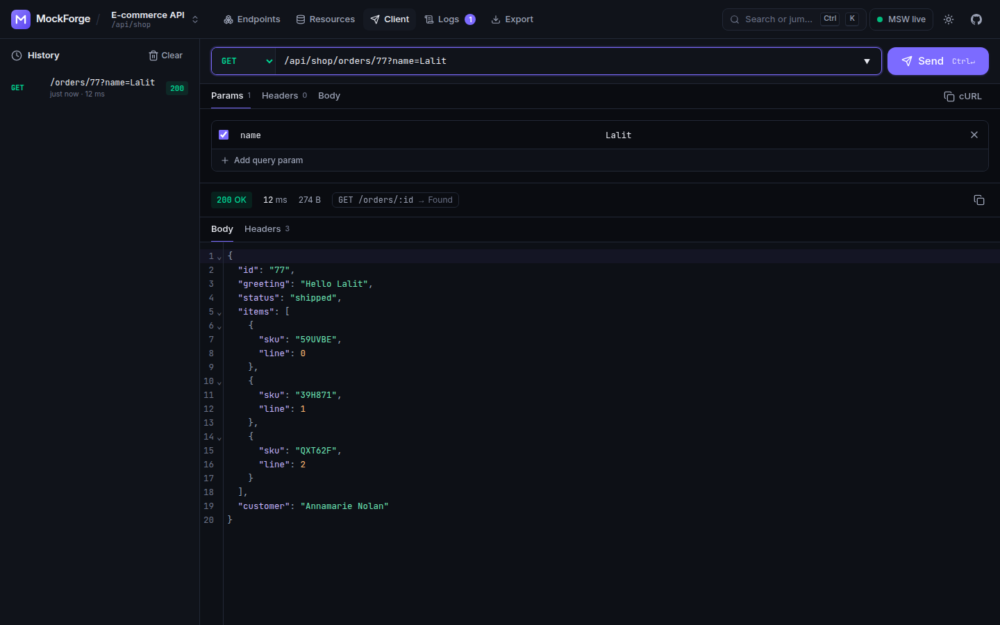 API client showing the templated response             | 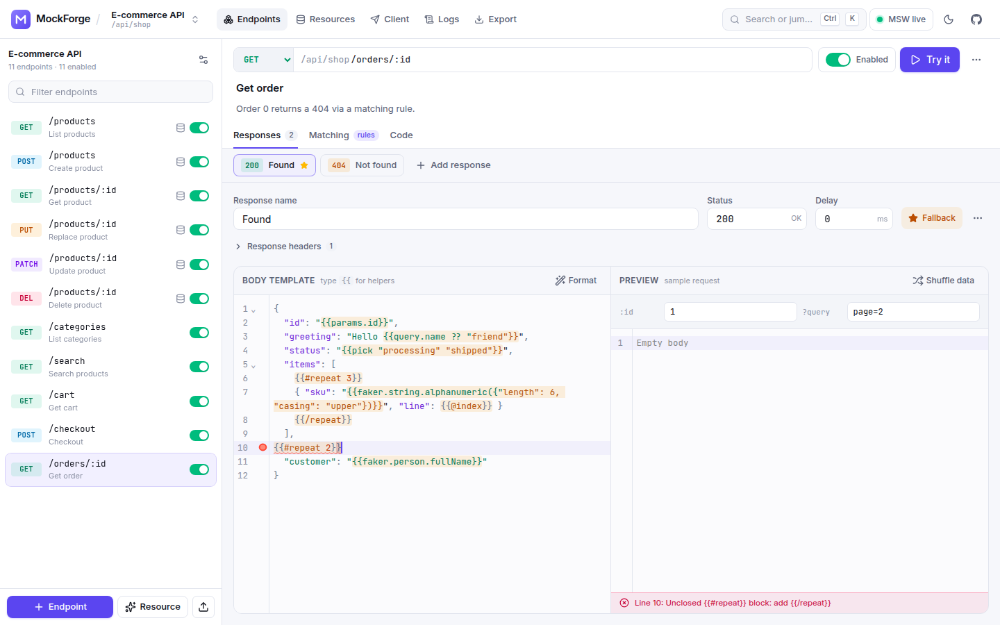 Inline template validation |
| 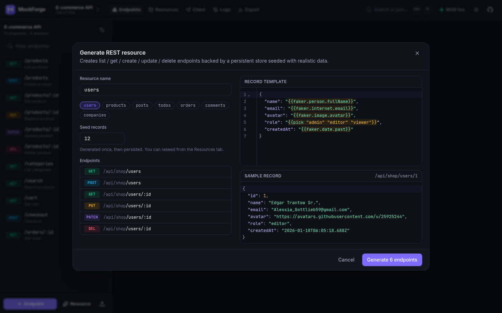 Generate a stateful REST resource | 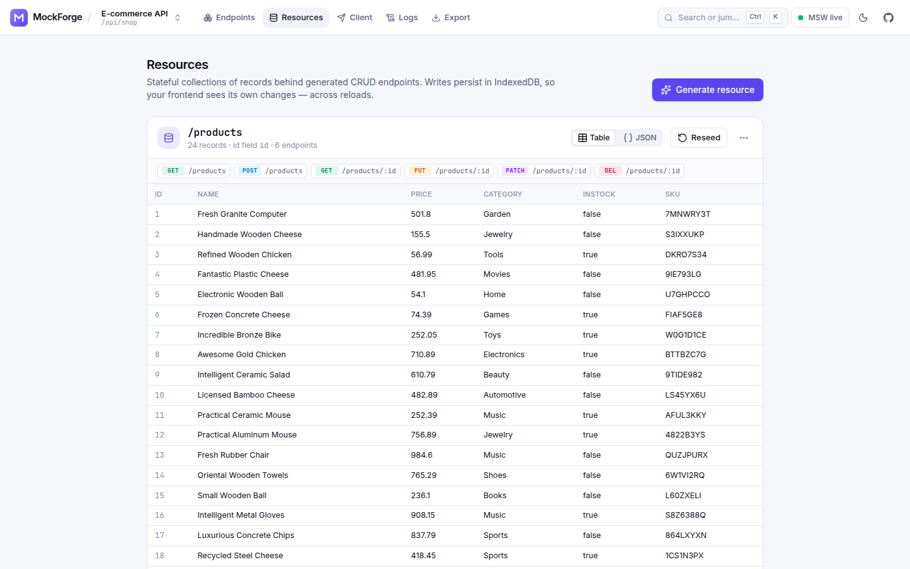 Persistent resource data                |
| 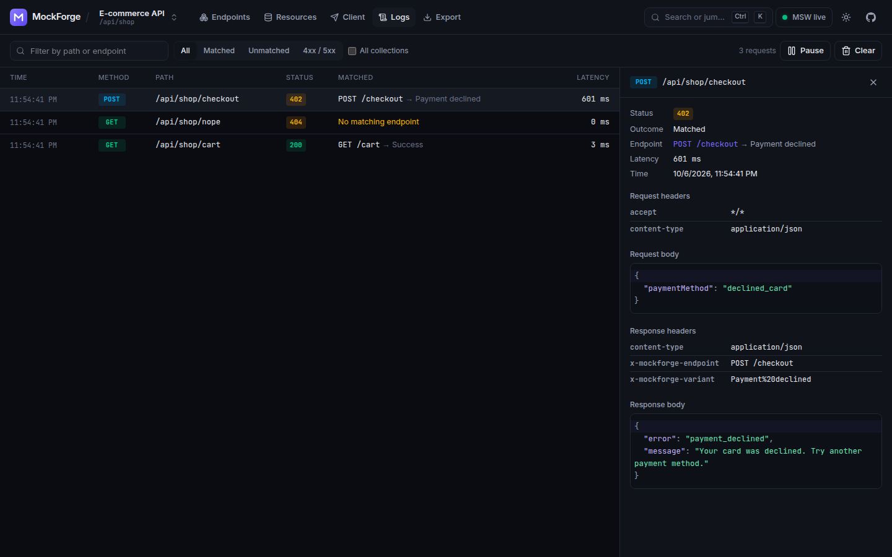 Request log with match details                     | 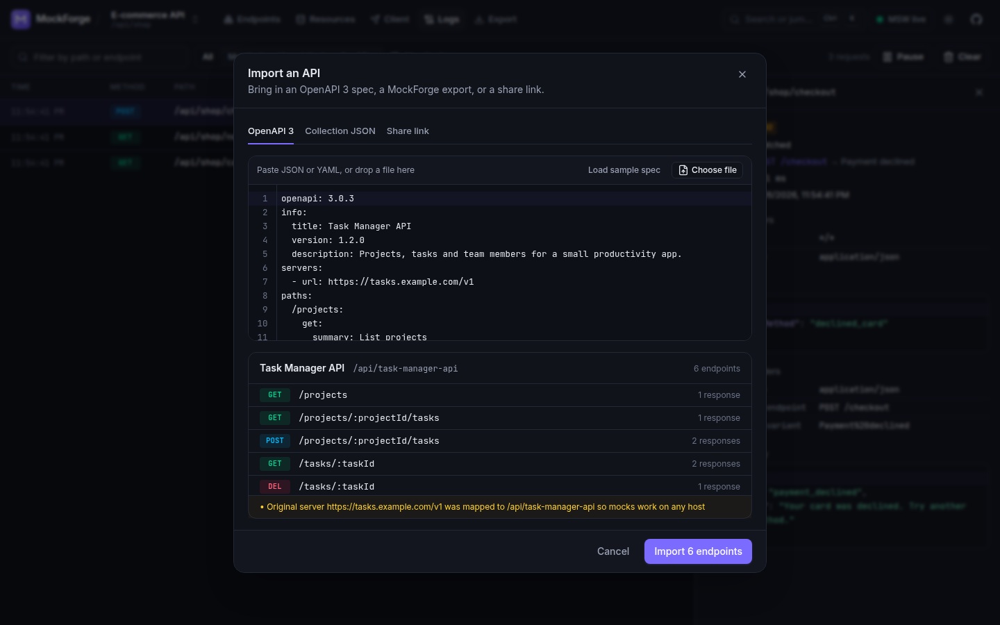 OpenAPI 3 import               |
| 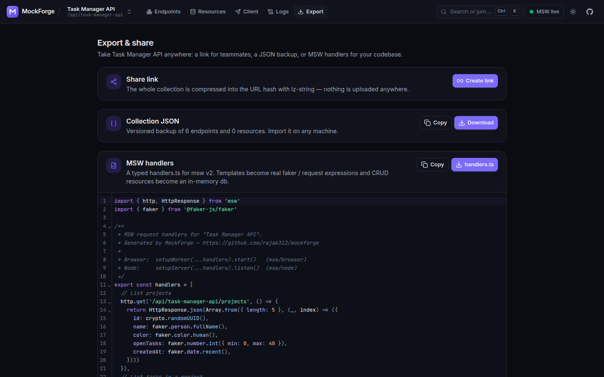 MSW handler export                                    | 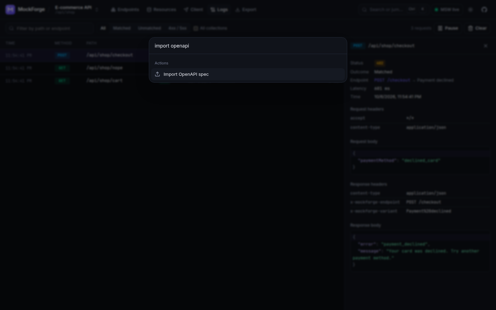 Command palette                      |
| 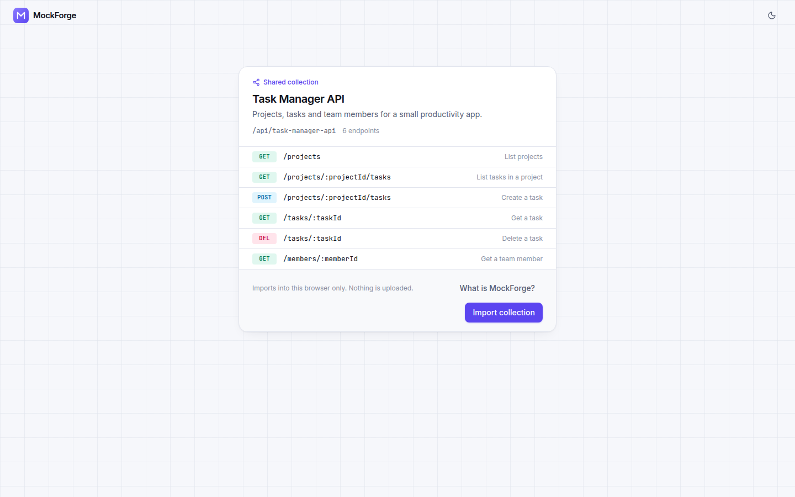 Importing a share link                                 | 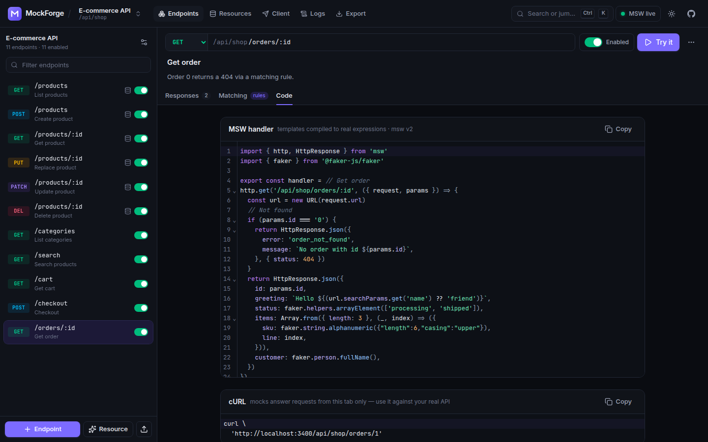 Per-endpoint MSW + cURL      |

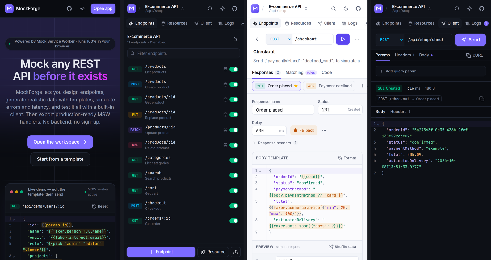

## Architecture

Everything runs in the browser. The app is a static SPA.

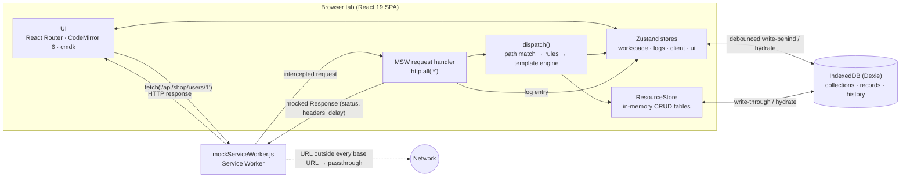

How a request is served:

1. The page (API client, landing demo, devtools or your own code) calls `fetch()`.
2. MSW's service worker intercepts it and forwards it to the single `http.all('*')` handler in the page.
3. The handler quickly checks whether the URL lives under any collection's base URL. If it doesn't (app assets, CDNs), the request passes through untouched.
4. `dispatch()` (pure and unit-tested) picks the collection with the longest base URL. It then finds the most specific enabled endpoint (static segments beat params beat wildcards; query matchers break ties) and selects a variant (active or rule-based). It renders the template, or for CRUD endpoints executes the operation against the `ResourceStore`. A path that exists under another method returns `405` with `Allow`; an unknown path returns a descriptive `404`.
5. The handler applies the delay and adds `X-MockForge-Endpoint` / `X-MockForge-Variant` headers. It records a log entry and returns a real `Response`.

Code layout:

```
src/
  lib/            framework-free core (all unit-tested)
    path-match.ts   Express-style matching, base URL handling & validation
    template/       parser (AST + offsets), renderer, linter
    dispatcher.ts   request → endpoint → variant → response
    resource-store.ts, crud.ts   stateful CRUD
    openapi.ts      OpenAPI 3 → collection (schema → template)
    codegen/        template → JS compiler, MSW handlers file, cURL
    serialize.ts    collection JSON + lz-string share links (defensive normalisation)
    starters/       E-commerce / Blog / Auth templates, sample OpenAPI spec
  mocks/          MSW worker setup + resource store runtime
  store/          Zustand stores (workspace persistence, logs, client, theme, ui)
  components/     UI primitives, CodeMirror editor, key/value editor
  features/       landing, shell, endpoints, resources, client, logs, export, share, palette
```

## Tech stack

Vite 8 · React 19 · TypeScript 5 (strict) · Tailwind CSS v4 · React Router 8 · Zustand 5 · Dexie 4 (IndexedDB) · CodeMirror 6 · MSW 2 · @faker-js/faker 10 · lz-string · yaml · cmdk · sonner · lucide-react · Vitest 5 + Testing Library + fake-indexeddb · ESLint 10 + typescript-eslint · Prettier.

## Local setup

Requires Node.js 20.19+ (CI uses 22; developed on 24).

```bash
git clone https://github.com/lalitkumarrajak/mockforge.git
cd mockforge
npm install
npm run dev        # http://localhost:3400
```

| Script              | What it does                              |
| ------------------- | ----------------------------------------- |
| `npm run dev`       | Vite dev server on port 3400              |
| `npm run build`     | Typecheck and production build to `dist/` |
| `npm run preview`   | Serve the production build on port 3400   |
| `npm run lint`      | ESLint (zero warnings allowed)            |
| `npm run typecheck` | `tsc -b` with strict settings             |
| `npm test`          | Vitest unit tests                         |
| `npm run format`    | Prettier                                  |

Service workers need a secure context: `localhost` or HTTPS.

## Deploy (Vercel)

1. Push the repository to GitHub.
2. In Vercel, choose **Add New → Project**, import the repo, and keep the detected **Vite** preset. Build command `npm run build` and output `dist` are already set in `vercel.json`.
3. Deploy.

`vercel.json` rewrites client-side routes (`/app/...`, `/share`) to `index.html`. It excludes `/assets/*`, `/favicon.svg` and **`/mockServiceWorker.js`**, so the worker script is always served as JavaScript and never replaced by the SPA shell. The worker is sent with `Cache-Control: no-cache` so MSW updates reach users, and hashed assets are cached immutably. Any other static host works too if it serves `mockServiceWorker.js` from the site root and falls back to `index.html` for unknown routes.

## Testing

```bash
npm test
```

94 unit tests cover:

- **Path matching**: params, optional params, wildcards, decoding, specificity, base URL stripping and validation.
- **Template engine**: expression parsing, faker calls with arguments, fallbacks, helpers, nested and ranged `repeat`, JSON escaping, error offsets, linting.
- **Dispatcher**: passthrough, specificity, query matchers, 404/405, rule-based variants, template errors, text bodies, 204, longest base URL, stateful CRUD.
- **CRUD resource store**: pagination, search, filters, sort, create/replace/merge/delete, conflicts, seeding, POST→GET.
- **OpenAPI → endpoints**: YAML/JSON, `$ref`, `allOf`, enums, recursion, examples, ordering, param binding, error cases.
- **MSW code generator**: object literals, `Array.from` repeats, template literals, rule branches, query guards, CRUD `db`, plus generated code evaluated for equivalence.
- **Share URLs and collection JSON**: round-trips, id regeneration and re-linking, size, corrupted input, normalisation of bad data.
- **Starter templates**: every template body lints clean and renders valid JSON.

The end-to-end flows (template → edit → client request → CRUD POST/GET → OpenAPI import → MSW export → share round-trip) were checked with headless Chrome against the production build. The exported `handlers.ts` files were typechecked with `tsc --strict` against real `msw@2` and `@faker-js/faker`.

## Known limitations

- Mocks only answer requests made from a tab where the service worker is active. A hard reload (Ctrl+Shift+R) bypasses service workers; the app detects this and shows a banner.
- Requests from other tools (terminal cURL, Postman) never reach the browser, so cURL snippets are meant for replaying against the real API.
- Absolute base URLs (`https://api.example.com`) are intercepted only while the worker controls the page. Relative bases are the most reliable.
- The request log is kept in memory (last 300 entries) and resets when the page reloads. Collections, resource data and client history persist in IndexedDB.
- Share links grow with the collection. Links over ~8k characters show a warning; use JSON export for large collections.
- OpenAPI 2.0 (Swagger) is not supported; convert it to OpenAPI 3 first.

## Author

**Lalit Kumar Rajak** — [github.com/lalitkumarrajak](https://github.com/lalitkumarrajak)

Released under the [MIT License](LICENSE).
